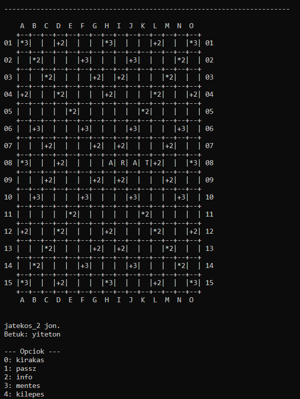

# Scrabble program

Scrabble játék szöveges interfésszel több játékosnak.
A játék konfigurációját és állapotát egy-egy mappában lehet tárolni.
A kezdő állapot az alap_jatek mappában található.
Részletesebb dokumentáció a doc mappában.



*A játék szöveges interfésze.*

## Buildelés

Buildelés: ```make```

Futtatás: ```bin/Scrabble.exe```

